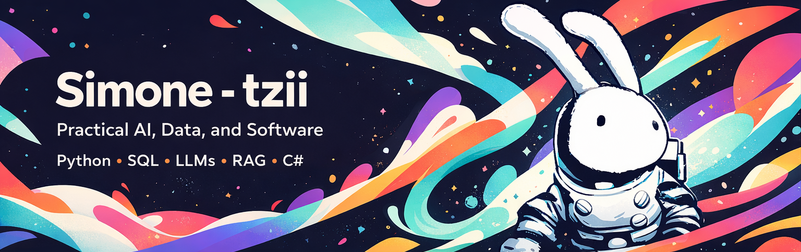

  

<h1 align="center">Hi, I'm Simo! 👋</h1>

  I build practical things with <strong>data, software, and AI</strong>.

  

  

---

## About me

Right now I'm at the tail end of my degree in **Artificial Intelligence & Data Analysis**, building projects in the meantime that sit somewhere between:

- “this is actually useful”
- “this probably should not have worked on the first try”
- “nice, now let's automate it”

## What I do

I’m mainly focused on:

- **Data analysis** and automation
- **Python** for real-world workflows
- **LLM / RAG** experimentation and implementation
- **SQL** and data handling
- **Frontend / web projects** when data deserves a decent interface
- **C# / .NET** when Microsoft-shaped problems appear in the wild

## A bit of background

I worked as an **AI Specialist**, where I dealt with:

- LLM solutions
- on-premise server setups
- open-source model evaluation
- RAG tools for business process optimization

So yes, I enjoy making machines read documents and act like they understand them.  
Sometimes they even do.

---

## Tech stack

### Languages & core tools

  

### Data / ML / AI

  
  
  
  
  
  
  

### Other stuff I touch willingly

  
  

---

## What you’ll find here

This profile is a mix of:

- data-related projects
- software experiments
- tools that solve annoying problems
- frontend work with more care than strictly necessary
- random technical curiosity, weaponized into repositories

---

## Featured projects

| Project | Description | Stack |
|---|---|---|
| [**ScrapingStore**](https://github.com/tzii/ScrapingStore) | Practical data pipeline with scraping, cleaning, storage, and analysis. Built to show that I like working with messy data almost as much as I like complaining about it. | Python, Pandas, SQL, Playwright, Docker |
| [**KeeFetch**](https://github.com/tzii/KeeFetch) | C# plugin project with actual documentation, releases, and structure. A rare case of a side project behaving like software and not like a digital crime scene. | C#, .NET |
| [**ThystTV**](https://github.com/tzii/ThystTV) | Mobile/open-source exploration that helped me get more comfortable with unfamiliar codebases and product logic. | Kotlin, Android |

---

## Current goals

I’m aiming for junior opportunities in:

- **Data / BI / Analytics**
- **AI-enabled software**
- **Frontend / data-heavy product work**
- **Software development with practical impact**

Basically: I like building things that are useful, understandable, and not held together entirely by hope.

---

## Languages

- **Italian**: native
- **English**: strong enough to study, work, attend meetings, and argue with documentation
- **French**: decent enough to survive

---

## GitHub stats

  
  

---

> If you're here to judge my code, fair.  
> If you're here to collaborate, even better.
